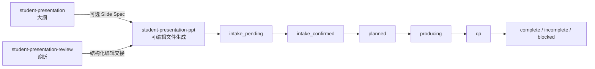

# Student Presentation Suite — Claude Code Marketplace

中文 | [English](README.md)

本仓库是 `student-presentation-suite` 的 Claude Code 专用发行版，只从
[`claude-code`](https://github.com/YFan945/student-presentation-suite/tree/claude-code)
分支发布。它面向大学课程汇报、答辩和小组展示，提供结构规划、可编辑 PPTX
生成与已有 deck 审查能力。

Marketplace 名称是 `claude-personal`，插件安装 ID 是
`student-presentation-suite@claude-personal`。

## 核心能力

- 生成或修改 PPTX 前执行完整需求澄清。
- 按用户目标路由到大纲、PPTX 生成或审查 skill。
- 通过 `document-skills@anthropic-agent-skills` 生成可编辑 PPTX。
- 使用 Slide Spec YAML 进行结构化规划和 review → edit 交接。
- 提供 14 种按需加载、可执行的视觉风格规范。
- 统一讲稿、预览图/contact sheet 和修改摘要交付契约。
- 提供静态检查、渲染 QA、交付门禁和环境诊断。
- 支持中英文、个人/小组、课程汇报、报告与答辩场景。

## Skill 与工作流

| Skill | 适用场景 | 边界 |
| --- | --- | --- |
| `student-presentation` | PPT 大纲、逐页讲稿规划、分工和可选 Slide Spec | 不创建 PPTX |
| `student-presentation-ppt` | 新建可编辑 PPTX，或生成已有 deck 的独立改进版 | 必须先确认完整需求表 |
| `student-presentation-review` | 审查、评分、风险诊断和具体修改建议 | 默认只读，除非用户明确要求改文件 |



PPTX 工作会先复用用户已经给出的信息，只询问缺失项，并为每项给出推荐值和
影响。即使用户说“你决定”，插件也必须展示完整 Production Summary 并获得
确认，之后才能运行环境检查、生成、渲染和交付命令。

## 环境要求

- Claude Code CLI
- Git
- Python 3.10+
- Node.js 与 npm
- `document-skills@anthropic-agent-skills`
- 插件声明的 Python 和 Node 依赖
- 严格渲染 QA 所需的 LibreOffice 与 Poppler

安装脚本会处理 marketplace 注册、旧插件迁移、Python/Node 依赖和上游
`document-skills` 插件。

## 安装或迁移

确保当前 checkout 位于 `claude-code` 分支，然后运行：

```powershell
Set-ExecutionPolicy -Scope Process Bypass
.\scripts\install_claude_plugin.ps1 -Migrate
```

脚本会：

- 不触碰 Codex 工作区；
- 删除旧 Claude `personal` 注册项及插件缓存；
- 安装 Python 和 Node 依赖；
- 将当前 checkout 注册为 `claude-personal`；
- 安装 `document-skills@anthropic-agent-skills`；
- 安装、启用并验证学生演示插件。

安装后需要重启 Claude Code。

### 常用安装参数

```powershell
# 已有 checkout，只重新注册，不重装依赖
.\scripts\install_claude_plugin.ps1 -SkipDependencies -SkipMarketplaceClone

# 安装到其他目录
.\scripts\install_claude_plugin.ps1 -InstallRoot D:\claude-plugins
```

## 手动开发安装

```powershell
git clone --branch claude-code --single-branch `
  git@github.com:YFan945/student-presentation-suite.git `
  "$env:USERPROFILE\.agents\claude-plugins"
Set-Location "$env:USERPROFILE\.agents\claude-plugins"
python -m pip install -r plugins/student-presentation-suite/requirements.txt
python -m pip install -r plugins/student-presentation-suite/requirements-claude-pptx.txt
npm --prefix plugins/student-presentation-suite ci
claude plugin marketplace add --scope user "$env:USERPROFILE\.agents\claude-plugins"
claude plugin install -s user document-skills@anthropic-agent-skills
claude plugin install -s user student-presentation-suite@claude-personal
```

## 仓库结构

```text
.claude-plugin/marketplace.json
.github/workflows/validate.yml
plugins/student-presentation-suite/
  .claude-plugin/plugin.json
  skills/
  references/
  scripts/
  shared/
  tests/
  examples/
scripts/
  install_claude_plugin.ps1
  check_marketplace_release.py
```

用户生成的文件统一写入当前项目的 `outputs/`，不得写入已安装插件目录。

## 验证

```powershell
$env:PYTHONPATH=(Resolve-Path "plugins/student-presentation-suite").Path
python -m unittest discover -s plugins/student-presentation-suite/tests
python plugins/student-presentation-suite/scripts/smoke_pptx.py
python plugins/student-presentation-suite/scripts/check_plugin_release.py --json
python scripts/check_marketplace_release.py --json
python plugins/student-presentation-suite/scripts/check_claude_pptx_env.py --json --strict
claude plugin validate --strict .\plugins\student-presentation-suite
claude plugin validate --strict .
git diff --check
```

CI 会在 Windows 和 Linux 上运行可移植测试、发布检查，并执行严格 Claude
manifest 验证。

## 发布约束

- Claude 专用改动只能提交和推送到 `claude-code`。
- `main` 保留为独立的 Codex 实现路线。
- Marketplace、插件 manifest、`package.json` 与 lockfile 版本必须一致。
- 发布级改动必须同步更新中英文 README 和 `CHANGELOG.md`。
- 完整贡献和发布约束见 [AGENTS.md](AGENTS.md)。

## License

MIT。见 [LICENSE](LICENSE)。
