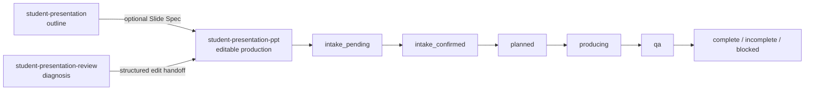

# Student Presentation Suite — Claude Code Marketplace

[中文](README-zh.md) | English

This repository is the Claude Code-only distribution of
`student-presentation-suite`, published from the
[`claude-code`](https://github.com/YFan945/student-presentation-suite/tree/claude-code)
branch. It provides structured university presentation planning, editable PPTX
production, and existing-deck review.

The marketplace name is `claude-personal`; the plugin ID is
`student-presentation-suite@claude-personal`.

## What It Provides

- A complete requirement intake before PPTX creation or editing.
- Student-context routing across outline, production, and review workflows.
- Editable PPTX generation through `document-skills@anthropic-agent-skills`.
- Slide Spec YAML for structured planning and review-to-edit handoff.
- Fourteen selectively loaded visual style specifications.
- Speaker notes, preview/contact-sheet, and change-summary contracts.
- Static checks, rendered visual QA, delivery gates, and environment diagnosis.
- Chinese, English, individual, group, coursework, report, and defense support.

## Skills And Workflow

| Skill | Use it for | Boundary |
| --- | --- | --- |
| `student-presentation` | Slide outline, speaking plan, group allocation, optional Slide Spec | Never creates PPTX files |
| `student-presentation-ppt` | New editable PPTX or an improved copy of an existing deck | Requires confirmed full intake |
| `student-presentation-review` | Review, audit, scoring, risks, and concrete fixes | Read-only unless editing is explicitly requested |



For PPTX work, the plugin reuses information already supplied, asks only for
missing requirements, recommends a value for each missing item, and explains
its impact. Even when the user says “you decide”, the plugin must show a
complete Production Summary and receive confirmation before running production
or environment commands.

## Requirements

- Claude Code CLI
- Git
- Python 3.10+
- Node.js and npm
- `document-skills@anthropic-agent-skills`
- Python and Node dependencies declared by the plugin
- LibreOffice and Poppler for strict rendered QA

The installation script handles marketplace registration, plugin migration,
Python/Node dependencies, and the upstream `document-skills` dependency.

## Install Or Migrate

Clone this repository on the `claude-code` branch, then run:

```powershell
Set-ExecutionPolicy -Scope Process Bypass
.\scripts\install_claude_plugin.ps1 -Migrate
```

The script:

- leaves the Codex workspace untouched;
- removes the obsolete Claude `personal` registration and its plugin cache;
- installs Python and Node dependencies;
- registers this checkout as `claude-personal`;
- installs `document-skills@anthropic-agent-skills`;
- installs, enables, and validates the student presentation plugin.

Restart Claude Code after installation.

### Useful Installer Options

```powershell
# Re-register an existing checkout without reinstalling dependencies
.\scripts\install_claude_plugin.ps1 -SkipDependencies -SkipMarketplaceClone

# Install into another marketplace checkout
.\scripts\install_claude_plugin.ps1 -InstallRoot D:\claude-plugins
```

## Manual Development Setup

```powershell
git clone --branch claude-code --single-branch `
  git@github.com:YFan945/student-presentation-suite.git `
  "$env:USERPROFILE\.agents\claude-plugins"
Set-Location "$env:USERPROFILE\.agents\claude-plugins"
python -m pip install -r plugins/student-presentation-suite/requirements.txt
python -m pip install -r plugins/student-presentation-suite/requirements-claude-pptx.txt
npm --prefix plugins/student-presentation-suite ci
claude plugin marketplace add --scope user "$env:USERPROFILE\.agents\claude-plugins"
claude plugin install -s user document-skills@anthropic-agent-skills
claude plugin install -s user student-presentation-suite@claude-personal
```

## Repository Layout

```text
.claude-plugin/marketplace.json
.github/workflows/validate.yml
plugins/student-presentation-suite/
  .claude-plugin/plugin.json
  skills/
  references/
  scripts/
  shared/
  tests/
  examples/
scripts/
  install_claude_plugin.ps1
  check_marketplace_release.py
```

All generated user artifacts are written to the active project's `outputs/`
directory. They are never written into the installed plugin.

## Validation

```powershell
$env:PYTHONPATH=(Resolve-Path "plugins/student-presentation-suite").Path
python -m unittest discover -s plugins/student-presentation-suite/tests
python plugins/student-presentation-suite/scripts/smoke_pptx.py
python plugins/student-presentation-suite/scripts/check_plugin_release.py --json
python scripts/check_marketplace_release.py --json
python plugins/student-presentation-suite/scripts/check_claude_pptx_env.py --json --strict
claude plugin validate --strict .\plugins\student-presentation-suite
claude plugin validate --strict .
git diff --check
```

CI runs the portable test and release checks on Windows and Linux and performs
strict Claude manifest validation.

## Release Policy

- Claude-specific changes are committed and published only on `claude-code`.
- `main` remains the independent Codex implementation line.
- Marketplace, plugin manifest, `package.json`, and lockfile versions must match.
- Update both README languages and `CHANGELOG.md` for release-worthy changes.
- See [AGENTS.md](AGENTS.md) for the complete contributor and release contract.

## License

MIT. See [LICENSE](LICENSE).
